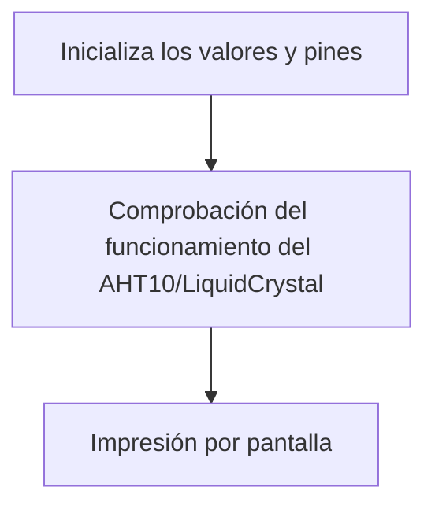

# Procesadores Digitales - Práctica 5

## Objetivo

El objetivo de esta práctica consiste en comprender y saber hacer funcionar diferentes buses, un sistema para poder comunicar periféricos tanto externos como internos al procesador. Concretamente, en esta práctica utilizaremos los buses I2C, SPI, I2S y usart. 

## I2C: Liquid Crystal y AHT10

En esta primera parte de de la práctica, vamos a realizar una comunicación I2C con dos periféricos. Uno de ellos, Liquid Crystal (LCD), es una pantalla de cristal líquido, tal y como su nombre indica, comunmente utilizada en dispositivos electrónicos, que permite mostrar información con una interfaz visual. El segundo periférico utilizado, es el AHT10, un sensor de alta precisión y bajo consumo que mide la temperatura y humedad relativa del ambiente. Interconnectando todas las partes, mostraremos por la pantalla del LCD, los datos captados por el sensor AHT10. Para ello, tendremos que incluir ciertas librerías para poder trabajar con más facilidad con Arduino: 

- ``#include <AHT10.h>``: necesaria para poder utlizar correctamente el componente (AHT10), que nos proporciona la temperatua y la humedad de su entorno.
- ``#include <Wire.h>``: nos proporciona la capacidad de comunicarnos con I2C/TWI con los diferentes componentes.
- ``#include <LiquidCrystal_I2C.h>``: nos proporciona la capacidad de escribir por la pantalla del componente (LiquidCrystal).

Después de eso, tenemos que declarar la cantidad de filas y columnas que queremos configurar en nuestra pantalla de cristal líquido. Para llevarlo a cabo, utilizaremos estas instrucciones:
````cpp
#define COLUMS           20  //para la cantidad de columnas
#define ROWS             4   //para el numero de filas
#define LCD_SPACE_SYMBOL 0x20//separacion entra caracteres
````
A continuación, establecemos una dirección I2C específica, para que nuestro ESP32 sepa de dónde sacar la información sobre la humedad y temperatura.

``AHT10 myAHT10(AHT10_ADDRESS_0X38);``

Empecemos con nuestro ``setup()``, en el que creamos un controlador para saber si nuestro sensor AHT10 se está ejecutando correctamente. En caso de fallo imprime por el serial: `AHT10 not connected or fail to load calibration coefficient`; en caso contrario: "``AHT10 OK``".
```cpp
  while (myAHT10.begin() != true)
  {
    Serial.println(F("AHT10 not connected or fail to load calibration coefficient")); //(F()) save string to flash & keeps dynamic memory free
    delay(5000);
  }
  Serial.println(F("AHT10 OK"));
```
Además, también realizará un control de nuestro Liquid Crystal como en el caso anterior. En caso de mal funcionamiento, se imprimirá ``"PCF8574 is not connected or lcd pins declaration is wrong. Only pins numbers: 4,5,6,16,11,12,13,14 are legal."`` por el terminal. Si al contrario, funciona correctamente, se avisará al usuario con ``"PCF8574 is OK..."``.

Para finalizar, nos queda desarrollar nuestro ``loop()``. Dentro, se dan las instrucciones de qué imprimir por la pantalla. Con ``lcd.println(F("xxxxx"))`` indicamos la información que queremos mostrar, siendo xxxxx esa información. Con la anterior línea de código, `lcd.setCursor(a, b)`, indicamos la fila en la que queremos mostrar, siendo a=0 y b enteros entre 0 y 3. 

Los datos extraídos por el sensor son llamados por la función `lcd.print(myAHT10.readTemperature/Humidity(AHT10_FORCE_READ_DATA))`, los cuales se van actualizando cada 11 segundos.

Al juntarlo todo, obtenemos este resultado:

```cpp
#include <Arduino.h>
#include <AHT10.h>
#include <Wire.h>
#include <LiquidCrystal_I2C.h>

#pragma GCC optimize ("O3")   //code optimisation controls - "O2" & "O3" code performance, "Os" code size

#define COLUMS           20   //LCD columns
#define ROWS             4    //LCD rows
#define LCD_SPACE_SYMBOL 0x20 //space symbol from LCD ROM, see p.9 of GDM2004D datasheet

LiquidCrystal_I2C lcd(PCF8574_ADDR_A21_A11_A01, 4, 5, 6, 16, 11, 12, 13, 14, POSITIVE);

uint8_t readStatus = 0;

AHT10 myAHT10(AHT10_ADDRESS_0X38);

void setup()
{
  Serial.begin(115200);
  Serial.println();
  
  while (myAHT10.begin() != true)
  {
    Serial.println(F("AHT10 not connected or fail to load calibration coefficient")); //(F()) save string to flash & keeps dynamic memory free
    delay(5000);
  }
  Serial.println(F("AHT10 OK"));

//Wire.setClock(400000); //experimental I2C speed! 400KHz, default 100KHz
  while (lcd.begin(COLUMS, ROWS, LCD_5x8DOTS) != 1) //colums, rows, characters size
  {
    Serial.println(F("PCF8574 is not connected or lcd pins declaration is wrong. Only pins numbers: 4,5,6,16,11,12,13,14 are legal."));
    delay(5000);   
  }

  lcd.print(F("PCF8574 is OK..."));    //(F()) saves string to flash & keeps dynamic memory free
  delay(2000);

  lcd.clear();  
}

void loop()
{
  lcd.setCursor(0, 0);
  lcd.println(F("PRACTICA 5"));
  lcd.setCursor(0, 1);
  lcd.print(F("Ona   Dídac"));
  lcd.setCursor(0, 2);
  lcd.print(F("Temperatura:")); lcd.print(myAHT10.readTemperature(AHT10_FORCE_READ_DATA)); 
  lcd.setCursor(0, 3);
  lcd.print(F("Humitat:")); lcd.print(myAHT10.readHumidity(AHT10_USE_READ_DATA)); 
  
  readStatus = myAHT10.readRawData(); //read 6 bytes from AHT10 over I2C

  delay(10000); //recomended polling frequency 8sec..30sec
}

```
Y la salida por el puerto serie es el siguiente:
```c
AHT10 not connected or fail to load calibration coefficient
AHT10 not connected or fail to load calibration coefficient
AHT10 OK
PCF8574 is not connected or lcd pins declaration is wrong. Only pins numbers: 4,5,6,16,11,12,13,14 are legal.
PCF8574 is OK...
```

### Diagrama de flujo

### Montaje
<image src='images/lcd.jpg' alt='lcd' width='400'>
<image src='images/lcd1.jpg' alt='lcd' width='400'>

## I2C: MAX30102

En esta segunda parte de la práctica, desarrollaremos una comunicación I2C con el periférico MAX30102. Este, es un sensor de pulso y oximetría de frecuencia cardíaca que utiliza tecnología óptica para medir el ritmo cardíaco y la saturación de oxígeno en sangre. Para comunicar el periférico con nuestro microprocesador ESP32, utilizaremos una una interfaz I2C y necesitaremos incluir dos librerías:

- ``#include <Wire.h>``
- ``#include "MAX30105.h"``: nos ofrece la capacidad para poder utlizar correctamente el componente MAX30102

Antes de empezar con el ``setup()``, es necesario crear un objeto MAX30105 que nombraremos ``particleSensor``.

Hecho esto, creamos un controlador para saber si nuestro medidor de pulsaciones se está ejecutando correctamente. En caso de fallida, entra en un bucle con ``while(1)`` e informa por el terminal `"MAX30105 was not found. Please check wiring/power."`.

A continuación, inicializamos los valores que consideremos adecuados para nuestro objeto, junto con el número de pulsaciones que queremos tomar para hacer la media.

```cpp
  //Setup to sense a nice looking saw tooth on the plotter
  byte ledBrightness = 0x1F; //Options: 0=Off to 255=50mA
  byte sampleAverage = 8; //Options: 1, 2, 4, 8, 16, 32
  byte ledMode = 3; //Options: 1 = Red only, 2 = Red + IR, 3 = Red + IR + Green
  int sampleRate = 100; //Options: 50, 100, 200, 400, 800, 1000, 1600, 3200
  int pulseWidth = 411; //Options: 69, 118, 215, 411
  int adcRange = 4096; //Options: 2048, 4096, 8192, 16384

  particleSensor.setup(ledBrightness, sampleAverage, ledMode, sampleRate, pulseWidth, adcRange); //Configure sensor with these settings

  const byte avgAmount = 64;
  long baseValue = 0;
```

Por último, nos queda realizar el sumador de pulsaciones que nos permitirá hacer la media de los valores obtenidos alrededor de las 64 muestras decididas anteriormente. Lo desarrollaremos con un bucle ``for()``. 
```cpp
  for (byte x = 0 ; x < avgAmount ; x++)
  {
    baseValue += particleSensor.getIR(); //Read the IR value
  }
  baseValue /= avgAmount;
```
Una vez obtenidos los valores, pondremos en fucionamiento otro bucle para realizar una escala de los valores más acurada, y así finalmente imprimir por el puerto serie el resultado final, con nuestro ```loop()```.

Al juntarlo todo, obtenemos este resultado:

```cpp
#include <Wire.h>
#include "MAX30105.h"

MAX30105 particleSensor;

void setup()
{
  Serial.begin(115200);
  Serial.println("Initializing...");

  // Initialize sensor
  if (!particleSensor.begin(Wire, I2C_SPEED_FAST)) //Use default I2C port, 400kHz speed
  {
    Serial.println("MAX30105 was not found. Please check wiring/power. ");
    while (1);
  }

  //Setup to sense a nice looking saw tooth on the plotter
  byte ledBrightness = 0x1F; //Options: 0=Off to 255=50mA
  byte sampleAverage = 8; //Options: 1, 2, 4, 8, 16, 32
  byte ledMode = 3; //Options: 1 = Red only, 2 = Red + IR, 3 = Red + IR + Green
  int sampleRate = 100; //Options: 50, 100, 200, 400, 800, 1000, 1600, 3200
  int pulseWidth = 411; //Options: 69, 118, 215, 411
  int adcRange = 4096; //Options: 2048, 4096, 8192, 16384

  particleSensor.setup(ledBrightness, sampleAverage, ledMode, sampleRate, pulseWidth, adcRange); //Configure sensor with these settings

  //Arduino plotter auto-scales annoyingly. To get around this, pre-populate
  //the plotter with 500 of an average reading from the sensor

  //Take an average of IR readings at power up
  const byte avgAmount = 64;
  long baseValue = 0;
  for (byte x = 0 ; x < avgAmount ; x++)
  {
    baseValue += particleSensor.getIR(); //Read the IR value
  }
  baseValue /= avgAmount;

  //Pre-populate the plotter so that the Y scale is close to IR values
  for (int x = 0 ; x < 500 ; x++)
    Serial.println(baseValue);
}

void loop()
{
  Serial.println(particleSensor.getIR()); //Send raw data to plotter
}
```
Por lo tanto, la salida por el terminal sería la siguiente, teniendo en cuenta que cada línea representa una lectura de infrarrojos (IR) capturada por el sensor MAX30105.

```
523
525
521
518
520
526
...
```
### Diagrama de flujo
```mermaid

flowchart TD;
    A[Inicialización serial]--> B[Se ha inicializado el sensor?];    
    B-- si -->G[Establece los valores de los parámetros del lector de pulsaciones];
    B-- no -->H[Error: MAX30105 was not found. Please check wiring/power];
    G-->p[Toma 64 valores y calcula la media];
    p-->w[Imprime 500 veces en el plotter los diversos valores calculados aproximadamente iguales a baseValue];
    w-->s[Lee pulsaciones periódicamente y las imprime por el plotter];
````


