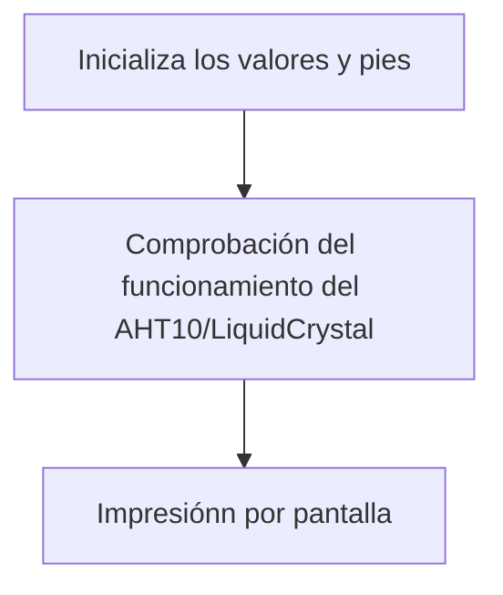

# Procesadores Digitales - Práctica 5

## Objetivo

El objetivo de esta práctica consiste en comprender y saber hacer funcionar los buses, un sistema para poder comunicar periféricos tanto externos como internos al procesador. Concretamente, en esta práctica utilizaremos los buses i2c, spi, i2s, usart. 

## PARTE 1 

En la parte 1 de de la práctica 5, vamos a realizar una comunicación I2c con un periférico (LIQUIDCRYSTAL/AHT10), el cual nos mostrará la temperatura y humedad del lugar. Para ello primero tendremos que incluir ciertas librerías: 

- ``#include <AHT10.h>`` esta librería es necesaria para poder utlizar correctamente el componente (AHT10), que nos proporciona la temperatua y la humedad de su entorno.
- ``#include <Wire.h>`` esta nos proporciona la capacidad de comunicarnos con I2C/TWI con los difrentes componentes.
- ``#include <LiquidCrystal_I2C.h>`` esta última, nos proporciona la capacidad de escribir por la pantalla del componente (LiquidCrystal).

Después de eso, tenemos que declarar la cantidad de filas y columnas que queremos configurar en nuestra pantalla de (LiquidCrystal). Para ello utilizaremos estas instrucciones.
````cpp
#define COLUMS           20  //para la cantidad de columnas
#define ROWS             4   //para el numero de filas
#define LCD_SPACE_SYMBOL 0x20//separacion entra caracteres
````

A continuación establecemos una dirección I2C específica, para que nuestro SP32 sepa dónde pedir la humedad.

``AHT10 myAHT10(AHT10_ADDRESS_0X38);``

Empecemos con nuestro ``setup()``, en el que creamos un controlador para saber si nuestro AHT10 (medidor de temperatura y humedad) se esta ejecutando correctamente. En caso de fallo imprime por pantalla ``AHT10 not connected or fail to load calibration coefficient`` y a viceversa en caso de funcionamiento "``AHT10 OK``".
```cpp
  while (myAHT10.begin() != true)
  {
    Serial.println(F("AHT10 not connected or fail to load calibration coefficient")); //(F()) save string to flash & keeps dynamic memory free
    delay(5000);
  }
  Serial.println(F("AHT10 OK"));
```
  A demás tambiénn realizará un control de nuestro LiquidCrystal como en el caso anterior, en la mal funcionamiento pondrá ``"PCF8574 is not connected or lcd pins declaration is wrong. Only pins numbers: 4,5,6,16,11,12,13,14 are legal."``. Y en buen ``"PCF8574 is OK..."``.

  Para finalizar nos queda desarrollar nuestro loop. En el se dan las instrucciones de que ipmrimir por pantalla. Con el lcd.setCursor(0, 0); le decimos a que fila y con lcd.println(F("PRACTICA 5")); que queremos que ponga.
  Important remarcar que los datos extraidos por nuestro AHT10, son llamados por nuesro liquidcrystal con la funcion ``lcd.print(myAHT10.readTemperature/Humidity(AHT10_FORCE_READ_DATA));``. Los cuales se van actualizando cada 11 segundos.

  Al juntarlo todo, obtenemos este resultado:

```cpp
#include <Arduino.h>
#include <AHT10.h>
#include <Wire.h>
#include <LiquidCrystal_I2C.h>

#pragma GCC optimize ("O3")   //code optimisation controls - "O2" & "O3" code performance, "Os" code size

#define COLUMS           20   //LCD columns
#define ROWS             4    //LCD rows
#define LCD_SPACE_SYMBOL 0x20 //space symbol from LCD ROM, see p.9 of GDM2004D datasheet

LiquidCrystal_I2C lcd(PCF8574_ADDR_A21_A11_A01, 4, 5, 6, 16, 11, 12, 13, 14, POSITIVE);

uint8_t readStatus = 0;

AHT10 myAHT10(AHT10_ADDRESS_0X38);

void setup()
{
  Serial.begin(115200);
  Serial.println();
  
  while (myAHT10.begin() != true)
  {
    Serial.println(F("AHT10 not connected or fail to load calibration coefficient")); //(F()) save string to flash & keeps dynamic memory free
    delay(5000);
  }
  Serial.println(F("AHT10 OK"));

//Wire.setClock(400000); //experimental I2C speed! 400KHz, default 100KHz
  while (lcd.begin(COLUMS, ROWS, LCD_5x8DOTS) != 1) //colums, rows, characters size
  {
    Serial.println(F("PCF8574 is not connected or lcd pins declaration is wrong. Only pins numbers: 4,5,6,16,11,12,13,14 are legal."));
    delay(5000);   
  }

  lcd.print(F("PCF8574 is OK..."));    //(F()) saves string to flash & keeps dynamic memory free
  delay(2000);

  lcd.clear();  
}

void loop()
{
  lcd.setCursor(0, 0);
  lcd.println(F("PRACTICA 5"));
  lcd.setCursor(0, 1);
  lcd.print(F("Ona   Dídac"));
  lcd.setCursor(0, 2);
  lcd.print(F("Temperatura:")); lcd.print(myAHT10.readTemperature(AHT10_FORCE_READ_DATA)); 
  lcd.setCursor(0, 3);
  lcd.print(F("Humitat:")); lcd.print(myAHT10.readHumidity(AHT10_USE_READ_DATA)); 
  
  readStatus = myAHT10.readRawData(); //read 6 bytes from AHT10 over I2C

  delay(10000); //recomended polling frequency 8sec..30sec
}

```

### Diagrama de flujo

## PARTE 2

En la parte 2 de la práctica 5, desarrollaremos una comunicación I2c con un perifèrico (MAX30102). Que nos servirá para medir las pulsaciones cardíacas del usuario. Como en la parte 1 primero habrá que incluir algunas librerías:

- ``#include <Wire.h>``, también la hemos utlizado en la práctca anterior, que recordemos que nos proporciona la capacidad de comunicarnos con I2C/TWI con los difeentes componentes.

- ``#include "MAX30105.h"``, nos ofrece la capacida para poder utlizar correctamente el componenet (MAX30102) y así extraer las pulsaciones cardíacas.

Antes de empezar con el ``setup()``, es necesario crear el objeto MAX30105 con el nombre ``particleSensor``.

Hecho esto, creamos un controlador para saber si nuestro MAX30102 (medidor de pulsaciones) se esta ejecutando correctamente. En caso de fallida, entra en un bucle ``while(1)`` y se imprimirá por pantalla ``"MAX30105 was not found. Please check wiring/power."``.

A continuación, inicializamos los volores que consideremos adecuados para nuestro objeto, junto con el numero de pulsaciones que queremos hacer de media.

```cpp
  //Setup to sense a nice looking saw tooth on the plotter
  byte ledBrightness = 0x1F; //Options: 0=Off to 255=50mA
  byte sampleAverage = 8; //Options: 1, 2, 4, 8, 16, 32
  byte ledMode = 3; //Options: 1 = Red only, 2 = Red + IR, 3 = Red + IR + Green
  int sampleRate = 100; //Options: 50, 100, 200, 400, 800, 1000, 1600, 3200
  int pulseWidth = 411; //Options: 69, 118, 215, 411
  int adcRange = 4096; //Options: 2048, 4096, 8192, 16384

  particleSensor.setup(ledBrightness, sampleAverage, ledMode, sampleRate, pulseWidth, adcRange); //Configure sensor with these settings

  //Arduino plotter auto-scales annoyingly. To get around this, pre-populate
  //the plotter with 500 of an average reading from the sensor

  //Take an average of IR readings at power up
  const byte avgAmount = 64;
  long baseValue = 0;
```

Por último, nos queda realizar el sumador de pulsaciones, el cual lo desarrollaremos con un bucle ``for()``. Que nos permitira hacer la media de los valores obtenidos alrededor de 64 muestras. 
```cpp
  for (byte x = 0 ; x < avgAmount ; x++)
  {
    baseValue += particleSensor.getIR(); //Read the IR value
  }
  baseValue /= avgAmount;

```
Una vez obtenidos los valores, pondremos en fucionamiento otro for para realizar una escala de los valores más acurada, y así finalmente imprimir por pantalla el resultado final, con nuestro ```loop()```.

Al juntarlo todo, obtenemos este resultado:

```cpp
#include <Wire.h>
#include "MAX30105.h"

  MAX30105 particleSensor;

void setup()
{
  Serial.begin(115200);
  Serial.println("Initializing...");

  // Initialize sensor
  if (!particleSensor.begin(Wire, I2C_SPEED_FAST)) //Use default I2C port, 400kHz speed
  {
    Serial.println("MAX30105 was not found. Please check wiring/power. ");
    while (1);
  }

  //Setup to sense a nice looking saw tooth on the plotter
  byte ledBrightness = 0x1F; //Options: 0=Off to 255=50mA
  byte sampleAverage = 8; //Options: 1, 2, 4, 8, 16, 32
  byte ledMode = 3; //Options: 1 = Red only, 2 = Red + IR, 3 = Red + IR + Green
  int sampleRate = 100; //Options: 50, 100, 200, 400, 800, 1000, 1600, 3200
  int pulseWidth = 411; //Options: 69, 118, 215, 411
  int adcRange = 4096; //Options: 2048, 4096, 8192, 16384

  particleSensor.setup(ledBrightness, sampleAverage, ledMode, sampleRate, pulseWidth, adcRange); //Configure sensor with these settings

  //Arduino plotter auto-scales annoyingly. To get around this, pre-populate
  //the plotter with 500 of an average reading from the sensor

  //Take an average of IR readings at power up
  const byte avgAmount = 64;
  long baseValue = 0;
  for (byte x = 0 ; x < avgAmount ; x++)
  {
    baseValue += particleSensor.getIR(); //Read the IR value
  }
  baseValue /= avgAmount;

  //Pre-populate the plotter so that the Y scale is close to IR values
  for (int x = 0 ; x < 500 ; x++)
    Serial.println(baseValue);
}

void loop()
{
  Serial.println(particleSensor.getIR()); //Send raw data to plotter
}

```

### Diagrama de flujo
```mermaid

flowchart TD;
    A[Se configura el plotter a 115200 / Imprime por pantalla: INITIALIZING ] -->B[Inicializa el sensor];    
    B-->G[En caso de funcionamiento ];
    B-->H[En caso de herror, imprime por patalla: MAX30105 was not found. Please check wiring/power ];
    G-->t[Inicializa valores del lectro de pulsaciones ];
    t-->p[64 lecturas i calcula la media];
    p-->w[impreime 500 veces en el ploter el valor calculado];
    w-->s[periódicamente lee pulsaciones y las imprime por el ploter];
````


